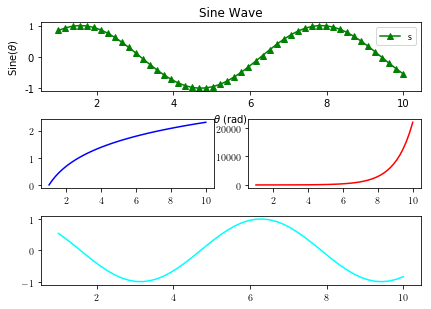

Title: Python for beginners !
Date: 2019-03-27
Category: Programming, Python
Tags: tutorial,python,programming
Slug: learn-python-for-beginners


# Introduction to Programming in Python

```
Take notes as you go! 
Do everything I demonstrate as much as you can.
Problems will come later.
```

###  Numbers


```python
1
```


    1


```python
10     # simple integer
```


    10


Code vs. comments

And when i use some **word that you are not familiar** with.  
Just **stop me and ask**. Because everyone else is also  
asking the same question in their head and i didn't realize.


```python
1.23e-3  # floating points in scientific notation
```


    0.00123


```python
2+3j   # complex numbers
```


    (2+3j)


```python
7*2 - 25/5    # basic arithmetic
```


    9.0


can't I store them or something?

yes. we store them. We can give them names which are called variables.

### Variables 

variables in python are:
1. implicitly declared.
2. dynamically typed.


```python
a = 5  # variable declaration and assignment
b = 2e-1  
c = a + b
print(c)
```

    5.2


```python
type(a)

# type() function gives the type of a variable
# or data.
```


    int


#### But, wait!  What are functions?

Functions in computer programs are like those in mathematics.  
They take some inputs, do something to them and (usually)   
return some output.

The Line we saw above is called a **function call**  
but you can also think of it as running a machine that performs  
a specific task.  
Inputs to a functions are called **arguments**.  
`functionName(argument1, argument2, ..)`  

And the result is called **return value**.


```python
type("hi everyone!")
```


    str


#### What's str ??

What we generally call "text" in normal talk is called string 
in programming.


```python
college = "St. Xavier's College"
```


```python
 1stName = "bibek"   # no digits allowed as the first character
# name_1st is okay!
```


      File "<ipython-input-10-092931d47764>", line 1
        1stName = "bibek"   # no digits allowed as the first character
              ^
    SyntaxError: invalid syntax


```python
class = "BSC-III"   # keywords are reserved
```


      File "<ipython-input-11-86ebb738ef0a>", line 1
        class = "BSC-III"   # keywords are reserved
              ^
    SyntaxError: invalid syntax


few more **keywords** are :  
**def, True, False, if, else, while, for, not, in**,  etc..


#### Strings in python are first class citizens !


```python
country = "Nepal"
```


```python
"I love " + country + "."
```


    'I love Nepal.'


^^    This is called concatenation ! Adding strings together.

You were talking about functions !!

Okay, here's one more!


```python
text = input("Enter some text: ")
# a function to take inputs from keyboard
```

    Enter some text: 


```python
text.replace("i", "y")
```


    ''


```python
text
```


    ''


```python
text.count("i"
```


      File "<ipython-input-17-c293c3f42586>", line 1
        text.count("i"
                      ^
    SyntaxError: unexpected EOF while parsing


```python
text.split(" ")
```


    ['']


```python
text.isdigit()
```


    False


```python
text[::-1]
```


    ''


#### Whoa ! What just happened??

### Splicing

`string[start:end:step]`


```python
statement = "PythonIsAwesome!"
```


```python
statement*2
```


    'PythonIsAwesome!PythonIsAwesome!'


```python
statement*5.0  # not allowed
```


    ---------------------------------------------------------------------------

    TypeError                                 Traceback (most recent call last)

    <ipython-input-23-98c3f2dda63f> in <module>
    ----> 1 statement*5.0  # not allowed
    

    TypeError: can't multiply sequence by non-int of type 'float'


```python
statement*statement   # not allowed
```


    ---------------------------------------------------------------------------

    TypeError                                 Traceback (most recent call last)

    <ipython-input-24-51b047b3f69f> in <module>
    ----> 1 statement*statement   # not allowed
    

    TypeError: can't multiply sequence by non-int of type 'str'


```python
statement[1:16:3]
```


    'yosem'


So, index starts at 0.


```python
statement[:16:3]  # omiting value means 0 for start and -1 for end
```


    'PhIwo!'


```python
statement[:] # step can be omitted and it defaults to 1.
```


    'PythonIsAwesome!'


```python
statement[::-1]   # that should explain it.
```


    '!emosewAsInohtyP'


#### Exercises about string and inputs

### Importing Modules
Tell me more about functions:

#### To get more functions ! 
you can import them.   
We import functions from what are called modules (C would call it library and header file.)  
`
import math
import numpy
`


```python
import math
```


```python
math.pi
```


    3.141592653589793


```python
math.e
```


    2.718281828459045


```python
math.sqrt(2)
```


    1.4142135623730951


```python
math.sin(math.pi) 
# not exactly zero because pi is  
# irrational and we've used finite decimals
```


    1.2246467991473532e-16


```python
math.sin(0)
```


    0.0


### function definition and Flow of execution

Let's create a function which takes two   
inputs - **base and height** of a right angled  
triangle and outputs the **hypotenuse**.  
  
Let's call the function `getHyp`


```python
# import math   <- this already done above.
def getHyp(a, b):
    h = math.sqrt(a**2 + b**2)
    return(h)
```


```python
getHyp(4, 3)
```


    5.0


```python
getHyp(getHyp(4,3), 12)  # Flow of execution
```


    13.0


Let's create a function which takes one   
input - **some text** (aka a string) and  
outputs the **number of occurance of letter e**.  
   
Let's call the function `countE`


```python
def countE(string):
    total = string.count("e")
    return total
```


```python
a  = "My name is Bibek and I'm not a terorist."
countE(a)
```


    3


Ex. Count e by taking input from keyboard

Ex. Count some letter by taking string and  
the letter **both** from keyboard.

### Namescope  

#### Lets talk about one more data type:
Boolean type:  
As the name suggests, it stores binary values: 


```python
a = True
b = False
```


```python
3 == 4
```


    False


```python
a == 1
```


    True


```python
False == False
```


    True


```python
False != True
```


    True


```python
3 >= 32
4 <= 5
"me" != "you"
```


    True


Yo sab ta thik xa I want more functions! Functions are cool!
## Some more functions!


```python
def absolute(n):
    if not (n < 0):    # could put the conditional in parenthesis!
        return(-n)
    else:
        return(n)
```

Write a function that takes age of the user from  
the **keyboard** and tells(*prints*) if the user is legally allowed  
to have license. (allowed if age is **at least 18**)

Some more functions!!

Write a program that takes a number **n**  
as argument and computes n! (n factorial)  
name the function `factorial`

#### Above is called a recursive function.  
a function that calls itself. 

Explain the recursion!

Bonus Question:  
   - Write a function `fibonacci(n)` that takes a  
    integer **n** and returns $n^{th}$ number of fibonacci  
    series: $1, 1, 2, 3, 5, 8, 13,$ etc... 


```python
import random    # random info 
random.random()
random.normalvariate(0, 1)  # mu and sigma
```


    -0.2294857773288854


Show the Thinking like a programmer slide  
from slide (page 14) before repetition

### Before we move on to repetition aspect; let's make a game !
It'll be a simple game. We can't make fortnite and PUBG yet.
**Game of Dice:**


```python
import math
import random
def rollDice():
    faceUp = math.ceil(random.random() * 6)
    return(faceUp)
```


```python
rollDice()    # now, if only we could run this on repeat !
```


    2


### Let me show you yet another function!


```python
def sumN(n):
    totalSum = 0
    for i in range(n+1):
        totalSum = totalSum + i
    return(totalSum)
```


```python
sumN(100)
```


    5050


Let's dissect the program !


```python
for i in range(10):  # explain for loop here !
    print(i)
```

    0
    1
    2
    3
    4
    5
    6
    7
    8
    9


```python
[i  for i in range(10)]  # list comprehension !
```


    [0, 1, 2, 3, 4, 5, 6, 7, 8, 9]


```python
[i**2  for i in range(10)]  # list comprehension !
```


    [0, 1, 4, 9, 16, 25, 36, 49, 64, 81]


```python
[i  for i in range(10) if (i % 2 == 0)]  
```


    [0, 2, 4, 6, 8]


```python
[i**2  for i in range(10) if (i % 2 == 0)]  
```


    [0, 4, 16, 36, 64]


`range(start, stop, step)` # doesn't include stop

So, range(n) gives a list of numbers from 0 to n-1. 

**Ex.** print the squares of first 10 natural numbers:


```python
for i in range(1, 11):
    print(i**2)
```

    1
    4
    9
    16
    25
    36
    49
    64
    81
    100


**Ex.** print the first 5 odd integers:


```python
for n in range(5):
    print(2*n+1)
```

    1
    3
    5
    7
    9


### range() returns what are known as iterables.  
We can put any interable in place of range() in for loop. 
One example is good old string.


```python
for i in "hello World!":
    print(i)
```

    h
    e
    l
    l
    o
     
    W
    o
    r
    l
    d
    !


#### Implement countE() function written above but without string.count() method.
using loops and conditionals


```python
six = "6"
sum = 0
for i in range(1, 667):
    newValue = six*i
    newValue = int(newValue)
    sum = sum + newValue
print(sum)
```

    740740740740740740740740740740740740740740740740740740740740740740740740740740740740740740740740740740740740740740740740740740740740740740740740740740740740740740740740740740740740740740740740740740740740740740740740740740740740740740740740740740740740740740740740740740740740740740740740740740740740740740740740740740740740740740740740740740740740740740740740740740740740740740740740740740740740740740740740740740740740740740740740740740740740740740740740740740740740740740740740740740740740740740740740740740740740740740740740740740740740740740740740740740740740740740740740740740740740740740740740740740740740740740740740740740740740740740740740740740740740740296


#### Write a program that lists all the numbers divisible by 7 but not a multiple of 5 between 1,000 and 3,000 (both included).

Let's do this with while loop 


```python
i = 1000             # think of i as saying 'index' or just a
                    # running variable that we are used to in Summation notation.
while (i <= 2000):
    if (i%7 == 0) and (i%5 != 0):
        print(i, ", ")
    i += 1
```

    1001 , 
    1008 , 
    1022 , 
    1029 , 
    1036 , 
    1043 , 
    1057 , 
    1064 , 
    1071 , 
    1078 , 
    1092 , 
    1099 , 
    1106 , 
    1113 , 
    1127 , 
    1134 , 
    1141 , 
    1148 , 
    1162 , 
    1169 , 
    1176 , 
    1183 , 
    1197 , 
    1204 , 
    1211 , 
    1218 , 
    1232 , 
    1239 , 
    1246 , 
    1253 , 
    1267 , 
    1274 , 
    1281 , 
    1288 , 
    1302 , 
    1309 , 
    1316 , 
    1323 , 
    1337 , 
    1344 , 
    1351 , 
    1358 , 
    1372 , 
    1379 , 
    1386 , 
    1393 , 
    1407 , 
    1414 , 
    1421 , 
    1428 , 
    1442 , 
    1449 , 
    1456 , 
    1463 , 
    1477 , 
    1484 , 
    1491 , 
    1498 , 
    1512 , 
    1519 , 
    1526 , 
    1533 , 
    1547 , 
    1554 , 
    1561 , 
    1568 , 
    1582 , 
    1589 , 
    1596 , 
    1603 , 
    1617 , 
    1624 , 
    1631 , 
    1638 , 
    1652 , 
    1659 , 
    1666 , 
    1673 , 
    1687 , 
    1694 , 
    1701 , 
    1708 , 
    1722 , 
    1729 , 
    1736 , 
    1743 , 
    1757 , 
    1764 , 
    1771 , 
    1778 , 
    1792 , 
    1799 , 
    1806 , 
    1813 , 
    1827 , 
    1834 , 
    1841 , 
    1848 , 
    1862 , 
    1869 , 
    1876 , 
    1883 , 
    1897 , 
    1904 , 
    1911 , 
    1918 , 
    1932 , 
    1939 , 
    1946 , 
    1953 , 
    1967 , 
    1974 , 
    1981 , 
    1988 , 


This just prints the numbers and exits.  
Wouldn't it be nice if there was a way  
to put them in a list ?  
That's what we are going to learn next:  List !

### Data Type: Lists


```python
a = [1,2,3]
```


```python
type(a)
```


    list


```python
len(a)
```


    3


```python
for i in a:   # list is also what is known as iterable
    print(i)
```

    1
    2
    3


```python
a.append(4)
```


```python
a.reverse()
```


```python
a.sort()   # how would you sort descending ? 
# also this sorts in place 
# can't recover original ordering
# optional parameter reverse=False
```


```python
b = sorted(a)   
# this takes input and gives output
# which means it doesn't tamper with original list  !
```


```python
a
```


    [1, 2, 3, 4]


Splicing a list works similar to splicing a string


```python
a[1:3]
```


    [2, 3]


```python
a[1:]
```


    [2, 3, 4]


```python
a[:2]
```


    [1, 2]


```python
a[::2]
```


    [1, 3]


#### Clear the list a and go back and put the above numbers in a !!


```python
import this
```

    The Zen of Python, by Tim Peters
    
    Beautiful is better than ugly.
    Explicit is better than implicit.
    Simple is better than complex.
    Complex is better than complicated.
    Flat is better than nested.
    Sparse is better than dense.
    Readability counts.
    Special cases aren't special enough to break the rules.
    Although practicality beats purity.
    Errors should never pass silently.
    Unless explicitly silenced.
    In the face of ambiguity, refuse the temptation to guess.
    There should be one-- and preferably only one --obvious way to do it.
    Although that way may not be obvious at first unless you're Dutch.
    Now is better than never.
    Although never is often better than *right* now.
    If the implementation is hard to explain, it's a bad idea.
    If the implementation is easy to explain, it may be a good idea.
    Namespaces are one honking great idea -- let's do more of those!


```python
import numpy as np
import matplotlib.pyplot as plt
```


```python
y = np.sin(a)
```


```python
from matplotlib import rc

a = np.linspace(1, 10, 50)   # start, end, how many points to sample
y = np.sin(a)

plt.subplot(3,1,1)
plt.tight_layout()

plt.plot(a,y, color='green', marker='^')
plt.rc('text', usetex=True)
plt.title("Sine Wave")
plt.xlabel(r"$\theta$ (rad)")
plt.ylabel(r"Sine($\theta$)")
plt.legend("sine")

plt.subplot(3,2,3)
plt.plot(a,np.log(a), color='blue')

plt.subplot(3,2,4)
plt.plot(a,np.exp(a), color='red')

plt.subplot(3,1,3)
plt.plot(a,np.cos(a), color='cyan')
plt.figure(num=None, figsize=(8, 8), dpi=80, facecolor='w', edgecolor='k')
```


    <Figure size 640x640 with 0 Axes>





    <Figure size 640x640 with 0 Axes>


### Working with Files


```python
file = open("new.txt", 'w')
file.writelines("2,8\n")
file.writelines("12,8\n")
file.writelines("2,18\n")
file.writelines("20,89")
file.write("1,32\n")
file.close()
```


```python
file = open("new.txt", 'r')   # file HANDLER
print(file.read())   # Try without print
file.close()         # This is required for safety.
```

    2,8
    12,8
    2,18
    20,891,32
    


There is also an append mode which just  
adds to the file without replacing

#### Prime numbers [Optional]


```python
def fact(n):
    return [x for x in range(1, n+1) if n%x == 0]
```


```python

```


```python
def prime(n):
    return([1,n] == fact(n))
```


```python

```


```python
prime(4)
```


    False


```python
prime(5)
```


    True


```python
def infiniteNumbers():
    i = 0
    while True:
        yield i
        i += 1
```


```python

```


```python
infiniteNumbers()
```


    <generator object infiniteNumbers at 0x7f4a378f3570>


```python
c = infiniteNumbers()
```


```python
next(c)
```


    0


```python
while True:
    a = next(c)
    if prime(a):
        print(a)
    if a >10000:
        break
```

    2
    3
    5
    7
    11
    13
    17
    19
    23
    29
    31
    37
    41
    43
    47
    53
    59
    61
    67
    71
    73
    79
    83
    89
    97
    101
    103
    107
    109
    113
    127
    131
    137
    139
    149
    151
    157
    163
    167
    173
    179
    181
    191
    193
    197
    199
    211
    223
    227
    229
    233
    239
    241
    251
    257
    263
    269
    271
    277
    281
    283
    293
    307
    311
    313
    317
    331
    337
    347
    349
    353
    359
    367
    373
    379
    383
    389
    397
    401
    409
    419
    421
    431
    433
    439
    443
    449
    457
    461
    463
    467
    479
    487
    491
    499
    503
    509
    521
    523
    541
    547
    557
    563
    569
    571
    577
    587
    593
    599
    601
    607
    613
    617
    619
    631
    641
    643
    647
    653
    659
    661
    673
    677
    683
    691
    701
    709
    719
    727
    733
    739
    743
    751
    757
    761
    769
    773
    787
    797
    809
    811
    821
    823
    827
    829
    839
    853
    857
    859
    863
    877
    881
    883
    887
    907
    911
    919
    929
    937
    941
    947
    953
    967
    971
    977
    983
    991
    997
    1009
    1013
    1019
    1021
    1031
    1033
    1039
    1049
    1051
    1061
    1063
    1069
    1087
    1091
    1093
    1097
    1103
    1109
    1117
    1123
    1129
    1151
    1153
    1163
    1171
    1181
    1187
    1193
    1201
    1213
    1217
    1223
    1229
    1231
    1237
    1249
    1259
    1277
    1279
    1283
    1289
    1291
    1297
    1301
    1303
    1307
    1319
    1321
    1327
    1361
    1367
    1373
    1381
    1399
    1409
    1423
    1427
    1429
    1433
    1439
    1447
    1451
    1453
    1459
    1471
    1481
    1483
    1487
    1489
    1493
    1499
    1511
    1523
    1531
    1543
    1549
    1553
    1559
    1567
    1571
    1579
    1583
    1597
    1601
    1607
    1609
    1613
    1619
    1621
    1627
    1637
    1657
    1663
    1667
    1669
    1693
    1697
    1699
    1709
    1721
    1723
    1733
    1741
    1747
    1753
    1759
    1777
    1783
    1787
    1789
    1801
    1811
    1823
    1831
    1847
    1861
    1867
    1871
    1873
    1877
    1879
    1889
    1901
    1907
    1913
    1931
    1933
    1949
    1951
    1973
    1979
    1987
    1993
    1997
    1999
    2003
    2011
    2017
    2027
    2029
    2039
    2053
    2063
    2069
    2081
    2083
    2087
    2089
    2099
    2111
    2113
    2129
    2131
    2137
    2141
    2143
    2153
    2161
    2179
    2203
    2207
    2213
    2221
    2237
    2239
    2243
    2251
    2267
    2269
    2273
    2281
    2287
    2293
    2297
    2309
    2311
    2333
    2339
    2341
    2347
    2351
    2357
    2371
    2377
    2381
    2383
    2389
    2393
    2399
    2411
    2417
    2423
    2437
    2441
    2447
    2459
    2467
    2473
    2477
    2503
    2521
    2531
    2539
    2543
    2549
    2551
    2557
    2579
    2591
    2593
    2609
    2617
    2621
    2633
    2647
    2657
    2659
    2663
    2671
    2677
    2683
    2687
    2689
    2693
    2699
    2707
    2711
    2713
    2719
    2729
    2731
    2741
    2749
    2753
    2767
    2777
    2789
    2791
    2797
    2801
    2803
    2819
    2833
    2837
    2843
    2851
    2857
    2861
    2879
    2887
    2897
    2903
    2909
    2917
    2927
    2939
    2953
    2957
    2963
    2969
    2971
    2999
    3001
    3011
    3019
    3023
    3037
    3041
    3049
    3061
    3067
    3079
    3083
    3089
    3109
    3119
    3121
    3137
    3163
    3167
    3169
    3181
    3187
    3191
    3203
    3209
    3217
    3221
    3229
    3251
    3253
    3257
    3259
    3271
    3299
    3301
    3307
    3313
    3319
    3323
    3329
    3331
    3343
    3347
    3359
    3361
    3371
    3373
    3389
    3391
    3407
    3413
    3433
    3449
    3457
    3461
    3463
    3467
    3469
    3491
    3499
    3511
    3517
    3527
    3529
    3533
    3539
    3541
    3547
    3557
    3559
    3571
    3581
    3583
    3593
    3607
    3613
    3617
    3623
    3631
    3637
    3643
    3659
    3671
    3673
    3677
    3691
    3697
    3701
    3709
    3719
    3727
    3733
    3739
    3761
    3767
    3769
    3779
    3793
    3797
    3803
    3821
    3823
    3833
    3847
    3851
    3853
    3863
    3877
    3881
    3889
    3907
    3911
    3917
    3919
    3923
    3929
    3931
    3943
    3947
    3967
    3989
    4001
    4003
    4007
    4013
    4019
    4021
    4027
    4049
    4051
    4057
    4073
    4079
    4091
    4093
    4099
    4111
    4127
    4129
    4133
    4139
    4153
    4157
    4159
    4177
    4201
    4211
    4217
    4219
    4229
    4231
    4241
    4243
    4253
    4259
    4261
    4271
    4273
    4283
    4289
    4297
    4327
    4337
    4339
    4349
    4357
    4363
    4373
    4391
    4397
    4409
    4421
    4423
    4441
    4447
    4451
    4457
    4463
    4481
    4483
    4493
    4507
    4513
    4517
    4519
    4523
    4547
    4549
    4561
    4567
    4583
    4591
    4597
    4603
    4621
    4637
    4639
    4643
    4649
    4651
    4657
    4663
    4673
    4679
    4691
    4703
    4721
    4723
    4729
    4733
    4751
    4759
    4783
    4787
    4789
    4793
    4799
    4801
    4813
    4817
    4831
    4861
    4871
    4877
    4889
    4903
    4909
    4919
    4931
    4933
    4937
    4943
    4951
    4957
    4967
    4969
    4973
    4987
    4993
    4999
    5003
    5009
    5011
    5021
    5023
    5039
    5051
    5059
    5077
    5081
    5087
    5099
    5101
    5107
    5113
    5119
    5147
    5153
    5167
    5171
    5179
    5189
    5197
    5209
    5227
    5231
    5233
    5237
    5261
    5273
    5279
    5281
    5297
    5303
    5309
    5323
    5333
    5347
    5351
    5381
    5387
    5393
    5399
    5407
    5413
    5417
    5419
    5431
    5437
    5441
    5443
    5449
    5471
    5477
    5479
    5483
    5501
    5503
    5507
    5519
    5521
    5527
    5531
    5557
    5563
    5569
    5573
    5581
    5591
    5623
    5639
    5641
    5647
    5651
    5653
    5657
    5659
    5669
    5683
    5689
    5693
    5701
    5711
    5717
    5737
    5741
    5743
    5749
    5779
    5783
    5791
    5801
    5807
    5813
    5821
    5827
    5839
    5843
    5849
    5851
    5857
    5861
    5867
    5869
    5879
    5881
    5897
    5903
    5923
    5927
    5939
    5953
    5981
    5987
    6007
    6011
    6029
    6037
    6043
    6047
    6053
    6067
    6073
    6079
    6089
    6091
    6101
    6113
    6121
    6131
    6133
    6143
    6151
    6163
    6173
    6197
    6199
    6203
    6211
    6217
    6221
    6229
    6247
    6257
    6263
    6269
    6271
    6277
    6287
    6299
    6301
    6311
    6317
    6323
    6329
    6337
    6343
    6353
    6359
    6361
    6367
    6373
    6379
    6389
    6397
    6421
    6427
    6449
    6451
    6469
    6473
    6481
    6491
    6521
    6529
    6547
    6551
    6553
    6563
    6569
    6571
    6577
    6581
    6599
    6607
    6619
    6637
    6653
    6659
    6661
    6673
    6679
    6689
    6691
    6701
    6703
    6709
    6719
    6733
    6737
    6761
    6763
    6779
    6781
    6791
    6793
    6803
    6823
    6827
    6829
    6833
    6841
    6857
    6863
    6869
    6871
    6883
    6899
    6907
    6911
    6917
    6947
    6949
    6959
    6961
    6967
    6971
    6977
    6983
    6991
    6997
    7001
    7013
    7019
    7027
    7039
    7043
    7057
    7069
    7079
    7103
    7109
    7121
    7127
    7129
    7151
    7159
    7177
    7187
    7193
    7207
    7211
    7213
    7219
    7229
    7237
    7243
    7247
    7253
    7283
    7297
    7307
    7309
    7321
    7331
    7333
    7349
    7351
    7369
    7393
    7411
    7417
    7433
    7451
    7457
    7459
    7477
    7481
    7487
    7489
    7499
    7507
    7517
    7523
    7529
    7537
    7541
    7547
    7549
    7559
    7561
    7573
    7577
    7583
    7589
    7591
    7603
    7607
    7621
    7639
    7643
    7649
    7669
    7673
    7681
    7687
    7691
    7699
    7703
    7717
    7723
    7727
    7741
    7753
    7757
    7759
    7789
    7793
    7817
    7823
    7829
    7841
    7853
    7867
    7873
    7877
    7879
    7883
    7901
    7907
    7919
    7927
    7933
    7937
    7949
    7951
    7963
    7993
    8009
    8011
    8017
    8039
    8053
    8059
    8069
    8081
    8087
    8089
    8093
    8101
    8111
    8117
    8123
    8147
    8161
    8167
    8171
    8179
    8191
    8209
    8219
    8221
    8231
    8233
    8237
    8243
    8263
    8269
    8273
    8287
    8291
    8293
    8297
    8311
    8317
    8329
    8353
    8363
    8369
    8377
    8387
    8389
    8419
    8423
    8429
    8431
    8443
    8447
    8461
    8467
    8501
    8513
    8521
    8527
    8537
    8539
    8543
    8563
    8573
    8581
    8597
    8599
    8609
    8623
    8627
    8629
    8641
    8647
    8663
    8669
    8677
    8681
    8689
    8693
    8699
    8707
    8713
    8719
    8731
    8737
    8741
    8747
    8753
    8761
    8779
    8783
    8803
    8807
    8819
    8821
    8831
    8837
    8839
    8849
    8861
    8863
    8867
    8887
    8893
    8923
    8929
    8933
    8941
    8951
    8963
    8969
    8971
    8999
    9001
    9007
    9011
    9013
    9029
    9041
    9043
    9049
    9059
    9067
    9091
    9103
    9109
    9127
    9133
    9137
    9151
    9157
    9161
    9173
    9181
    9187
    9199
    9203
    9209
    9221
    9227
    9239
    9241
    9257
    9277
    9281
    9283
    9293
    9311
    9319
    9323
    9337
    9341
    9343
    9349
    9371
    9377
    9391
    9397
    9403
    9413
    9419
    9421
    9431
    9433
    9437
    9439
    9461
    9463
    9467
    9473
    9479
    9491
    9497
    9511
    9521
    9533
    9539
    9547
    9551
    9587
    9601
    9613
    9619
    9623
    9629
    9631
    9643
    9649
    9661
    9677
    9679
    9689
    9697
    9719
    9721
    9733
    9739
    9743
    9749
    9767
    9769
    9781
    9787
    9791
    9803
    9811
    9817
    9829
    9833
    9839
    9851
    9857
    9859
    9871
    9883
    9887
    9901
    9907
    9923
    9929
    9931
    9941
    9949
    9967
    9973


##### Put this ^^ on a file 


```python

```


```python
from datetime import date 
```


```python
today = date.today()
```


```python
print(today)
```

    2019-03-28


```python
today.year
```


    2019


```python
tomorow = date(2020, 12, 22) # read date
```


```python
type(tomorow)
```


    datetime.date


```python
print(tomorow)
```

    2020-12-22


```python
[x for x in range(20) if x%2 == 0]
```


    [0, 2, 4, 6, 8, 10, 12, 14, 16, 18]


### 2D array [optional]


```python
matrix = [[2,3], [3,4]]
```


```python
matrix
```


    [[2, 3], [3, 4]]


```python
matrix[1]
```


    [3, 4]


```python
matrix[1][0]
```


    3


```python
for row in matrix:
    for element in row:
        print(element)
```

    2
    3
    3
    4


```python
for row in range(len(matrix)):  
    for column in range(len(matrix[row])):
        print(matrix[row][column])
        
# This is where the range not including the <stop> and beginning
# from value 0 by default makes sense.
```

    2
    3
    3
    4

